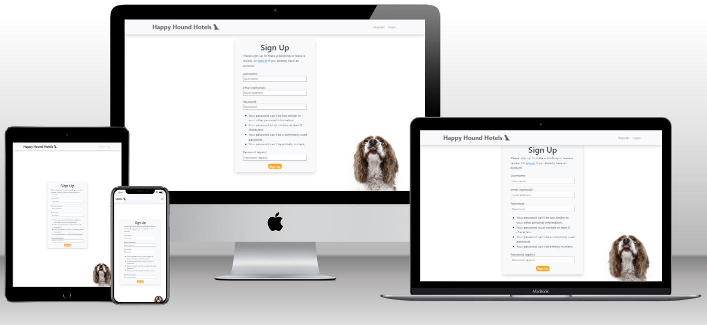

# Happy Hound Hotels

[Happy Hound Hotels](https://happy-hound-hotels-738781c0298e.herokuapp.com/) is a web platform designed to cater to the needs of pet owners and pet accommodation providers. The website facilitates the booking of kennels for pets, allowing users to find suitable accommodations for their furry friends while they are away. Whether it's a weekend getaway or an extended trip, "Happy Hound Hotels" aims to ensure that pets are well cared for in their owners' absence.

## Contents

- [Mission Statement](#mission-statement)
- [User Experience (UX)](#user-experience-ux)
    - [User Stories](#user-stories)
    - [Structure](#structure)
- [Agile Development Approach](#agile-development-approach)
- [Design Overview](#design-overview)
- [Technology Stack](#technology-stack)
- [Data Models](#data-models)
- [Features](#features)
- [Testing](#testing)
    - [User Stories Testing](#user-stories-testing)
    - [Unit Tests](#unit-tests)
    - [Code Validator Checks](#code-validator-checks)
    - [Lighthouse](#lighthouse)

# Mission Statement

Happy Hound Hotels is dedicated to offering pet owners the utmost convenience in finding top-notch accommodations for their beloved pets. Our platform serves as a user-friendly hub where pet owners can effortlessly connect with reputable kennels, ensuring their furry companions receive the care and attention they deserve while they are away. By prioritising convenience and fostering trust between owners and accommodation providers, Happy Hound Hotels aims to create a seamless and stress-free experience for all parties involved, promoting peace of mind and satisfaction throughout the pet care journey.

A link to the live website can be found [here](https://happy-hound-hotels-738781c0298e.herokuapp.com/).

# User Experience (UX)

## User Stories

### Target Audience

The primary target audiences for Happy Hound Hotels are pet owners and pet accommodation providers. Pet owners rely on the platform to find suitable accommodations for their furry companions when they're away, seeking convenience, reliability, and peace of mind. On the other hand, pet accommodation providers, including boarding kennels and pet hotels, utilize the website to attract pet owners and streamline their booking processes. By catering to the needs of these two key groups, Happy Hound Hotels aims to create a seamless and efficient booking experience for both pet owners and accommodation providers alike.

### Implemented User Stories

This section outlines the user stories that have been successfully incorporated into the project, detailing the functionality and features currently available to users.

### As a site user I can...

- make an account so that I can book a kennel.
- search for kennels so that I can book my pet in.
- view a list of kennels so that I can see available places to stay for my pet.
- view a kennel page so that I can book a stay for my pet.
- view a list of reviews so that I can see which kennels are good to stay at.
- leave a review so that other users can see what people thought about their pet's stay.
- edit or delete a review so that I can rectify any mistakes I may have made.
- book a kennel so that my pet/s have somewhere to stay while I am away.

### As a site admin I can...

- register a kennel so that users can book their pet's stay.

### Future User Stories

Here, you'll find user stories that are planned for implementation in future updates of the project. These stories represent potential enhancements and additions to the website's functionality.

### As a site user I can...

- arrange the kennel list order so that I can sort kennels by my preferred method.
- rate kennels so that other users can see how good or bad they are.
- create a profile so that I can store contact details and pets.
- add pets to my account so that I can store their information for later.
- create pet profiles so that I can store vaccination documents and vet details.

### As a site admin I can...

- approve vaccination documents so that legitimacy is maintained.
- flag inappropriate or inaccurate reviews so that users do not receive false or offensive information.
- respond to reviews so that I can assure customers that any issues have been resolved.
- approve bookings so that site users can take their pet's to the kennel.

## Structure

### Home Page

The homepage of Happy Hound Hotels keeps things simple yet effective. At the center, there's a handy search bar where users can easily find kennels for their pets by entering check-in/check-out dates and the number of pets. The inviting prompt 'Find a kennel...' encourages users to start their search. Below, a catchy slogan adds a friendly touch.

### Register Page

The registration page on Happy Hound Hotels is your gateway to accessing all the platform has to offer. Here, users can create their personal accounts in just a few simple steps. By providing basic information and creating a secure password, users gain access to features like booking kennels and leaving reviews.

### Login Page

The login page on Happy Hound Hotels provides registered users with access to their accounts and the full range of platform features. With just a few clicks, users can securely log in using their credentials, gaining instant access to booking kennels and leaving reviews.

### Kennel List Page

The kennel list page on Happy Hound Hotels displays a curated list of available kennels that can accommodate the user's selected number of pets during the specified dates. Users can easily browse through the list to find suitable accommodations for their furry companions. Each listing provides essential details about the kennel, such as location, a small description and the price per night.

### Kennel Detail Page

The kennel detail page on Happy Hound Hotels provides comprehensive information about each kennel, including its address, contact number, and detailed description. Users can explore reviews from other pet owners to get a sense of the kennel's quality and reputation. Additionally, the page offers a convenient link to the booking page displaying a simple form, allowing users to easily transition from browsing to initiating the booking process.

[^ Back to top ^](#happy-hound-hotels)

# Agile Development Approach

Happy Hound Hotels adopts an Agile development approach, which emphasizes iterative development, flexibility, and customer collaboration. Agile methodology allows for continuous improvement and the ability to adapt to changing requirements throughout the development process.

### User Story Labels

User stories in the Happy Hound Hotels project are categorized using different labels to prioritize features and functionalities. These labels include:

- Must-Have: Essential features that are critical for the core functionality of the application and must be implemented in the initial release.
- Should-Have: Important features that enhance the user experience or provide additional value but are not essential for the core functionality.
- Would-Have: Features that are desirable but can be deferred to future releases if time or resources are limited.
- Could-Have: Nice-to-have features that are considered low priority and may be implemented if there is extra time or resources available.

These labels help prioritize user stories based on their importance and impact on the overall project goals.

[^ Back to top ^](#happy-hound-hotels)

# Design Overview

The design of Happy Hound Hotels focuses on simplicity, usability, and a pet-friendly aesthetic. Leveraging existing resources and customisation, the project achieves a visually appealing and intuitive user experience.

### Search Bar Design

The styling for the search bar, a central element of the homepage and kennel list page, was originally sourced from Colorlib.com and since been extensively customised to meet the specific needs of the project. Its functionality allows users to easily select check-in and check-out dates and specify the number of pets, facilitating a seamless booking process.

### Frameworks and Tools

- **Bootstrap:** The project primarily utilises the Bootstrap framework for its responsive layout and pre-designed components, ensuring consistency and compatibility across devices.

- **jQuery UI:** jQuery UI was employed for the datepicker functionality, enhancing user interaction and providing an intuitive way for users to select dates during the booking process.

- **Custom CSS:** Where necessary, custom CSS styles were applied to enhance the design and tailor specific elements to match the project's branding and visual identity.

### Image Sources

- **Pixabay:** High-quality images featured throughout the website were sourced from Pixabay, a platform offering free stock photos, illustrations, and vectors. These images contribute to the overall aesthetic and ambiance of the site.

### Logo Design

- **Logo.com:** The project's distinctive logo was created using Logo.com, a user-friendly platform for designing professional logos. The logo reflects the pet-friendly nature of the website and serves as a recognizable symbol of the brand.

### Favicon Creation

- **Favicon.io:** Custom favicons were generated using Favicon.io, a favicon generator tool that simplifies the process of creating small, iconic images displayed in web browser tabs. These favicons provide a cohesive branding experience and enhance the website's visual identity.

[^ Back to top ^](#happy-hound-hotels)

# Technology Stack

### Backend Framework

- Django: Django served as the primary backend framework, providing robust features for building web applications, including user authentication, data management, and routing.

### Frontend Framework

- Bootstrap: Bootstrap was utilised extensively for frontend development, offering a collection of CSS and JavaScript components for building responsive and mobile-first websites.

### Database Management

- Code Institute's Database Maker: The Code Institute's Database Maker streamlined database management by providing a straightforward interface for users to input their email addresses and receive a new Postgres database URL. This simplified the process of accessing and managing the project's database, enhancing efficiency and convenience for developers.

### Cloud Storage

- Cloudinary Storage: Cloudinary Storage facilitated the storage and management of media files, such as images, in the cloud.

### Authentication and Authorisation

- Django Allauth: Django Allauth provided authentication and authorisation functionalities, allowing users to register, log in, and manage their accounts securely.

### Frontend Design

- jQuery UI: jQuery UI was used for the datepicker feature, enhancing the user experience by providing a user-friendly interface for selecting dates.

### Development Environment

- GitPod: GitPod served as the development environment, providing an integrated development environment (IDE) accessible via the browser.

### Deployment Platform

- Heroku: Heroku was utilized as the deployment platform, allowing for the hosting and deployment of the web application.

### Additional Libraries and Tools

- Crispy Forms: Crispy Forms enhanced form rendering in Django, providing elegant and customisable form layouts.
- Crispy Bootstrap5: Crispy Bootstrap5 extended the functionality of Crispy Forms by integrating Bootstrap 5 styling.
- Cloudinary: Cloudinary offered cloud-based image and video management services, facilitating seamless media handling within the application.

[^ Back to top ^](#happy-hound-hotels)

# Data Models

This section outlines the structure of the data models used in the Happy Hound Hotels project.

### Kennel

| Field          | Type          |
|----------------|---------------|
| PK             | INT           |
| name           | STR           |
| slug           | SLUG          |
| kennel_image   | CLOUDINARY    |
| description    | TEXT          |
| address_line_1 | STR           |
| address_line_2 | STR (optional)|
| city           | STR           |
| county         | STR           |
| postal_code    | STR           |
| contact_number | STR           |
| price_per_night| DECIMAL       |
| spaces         | INT           |

### Booking

| Field           | Type               |
|-----------------|--------------------|
| PK              | INT                |
| customer        | ForeignKey(User)   |
| num_pets        | INT                |
| kennel          | ForeignKey(Kennel) |
| check_in_date   | DATE               |
| check_out_date  | DATE               |

### Review

| Field         | Type                |
|---------------|---------------------|
| PK            | INT                 |
| kennel        | ForeignKey(Kennel)  |
| author        | ForeignKey(User)    |
| body          | TEXT                |
| created_on    | DATETIME            |

[^ Back to top ^](#happy-hound-hotels)

# Features

This section highlights the key features of the Happy Hound Hotels website.

### Authentication

The website provides user authentication functionality, allowing users to securely register and login to their accounts.

- **User Authentication:** Users can log in securely using their email and password.

  

- **User Registration:** New users can register for an account by providing basic information and creating a password.

  

### Navbar

The website includes a responsive navigation bar (navbar) that allows users to navigate between different sections of the website easily.

#### Navbar for larger screen sizes:

#### Navbar for smaller screen sizes:

### Search Bar

A user-friendly search bar is available on the homepage, enabling users to search for available kennels based on their check-in and check-out dates, as well as the number of pets.

#### Search bar for larger screen sizes:

#### Search bar for smaller screen sizes:

### Kennel List

The Kennel List page displays a list of available kennels that match the user's search criteria. Users can view essential information about each kennel, such as its name, description, and price per night.

### Kennel Detail

The Kennel Detail page provides detailed information about a specific kennel, including its address, contact number, and customer reviews. Users can read reviews from other customers and leave their own feedback.

### Booking Form

On the Kennel Detail page, users can find a link to a booking form where they can specify the check-in date, check-out date, and number of pets for their stay. Once submitted, the booking form allows users to book the selected kennel.

### Footer

The website features a footer section that provides additional information and links, such as social media links, and copyright details.

[^ Back to top ^](#happy-hound-hotels)

# Testing

This section covers the testing processes and tools used to ensure the quality and functionality of the Happy Hound Hotels website.

## User Stories Testing

The table below summarises the testing of user stories, comparing the expected outcomes with the actual outcomes.

| User Story | Expected Outcome  | Actual Outcome |
|------------|-------------------|----------------|
| Admin can register a kennel | Admin should be able to successfully register a kennel. | Admin successfully registers a kennel. |
| User can register for an account | User should be able to successfully register for an account. | User successfully registers for an account. |
| User can search for kennels | User should be able to search for kennels using the search bar. | Search functionality allows users to search for kennels as expected. |
| User can view a list of kennels | User should see a list of available kennels displayed on the page. | Kennel list displays correctly, showing available kennels as expected. |
| User can view a kennel page | User should be able to view a page showing detailed information about a specific kennel. | Kennel detail page shows accurate information about the selected kennel. |
| User can book a kennel | User should be able to successfully book a kennel using the booking form. | Booking form allows users to book kennels successfully. |
| User can view a list of reviews | User should see a list of reviews displayed on the kennel detail page. | Reviews list displays all available reviews as expected. |
| User can leave a review | User should be able to leave a review for a kennel. | Review submission form allows users to leave reviews as expected. |
| User can edit or delete reviews | User should be able to edit or delete their own reviews. | Editing and deleting reviews functionality works as expected. |

## Unit Tests

## Code Validator Checks

### HTML

Below screenshots show validator checks for each file that includes HTML code within this project. All code has been passed through [W3 Markup Validation Service](https://validator.w3.org/) HTML validator with no errors found.

#### base.html

### CSS

Below screenshot shows the validator check for the CSS code within this project. All code has been passed through [W3 Jigsaw](https://jigsaw.w3.org/css-validator/) CSS validator with no errors found.

#### style.css

### Python

Below screenshots show validator checks for each file that includes Python code within this project. All code has been passed through [CI Python Linter](https://pep8ci.herokuapp.com/) with no errors found.

### happy_hound_hotels/...

#### asgi.py

#### settings.py

**NOTE:** 4 validator errors appear due to AllAuth password validator variables being very long.

#### urls.py

#### wsgi.py

### kennel_manager/...

#### admin.py

#### apps.py

#### forms.py

#### models.py

#### urls.py

#### views.py

### JavaScript

Below screenshots show validator checks for each file that includes JavaScript code within this project. All code has been passed through [JSHint](https://jshint.com/) with no errors found.

#### reviews.js

**NOTE:** All warnings shown relate to complaints about ES6 syntax.

#### script.js

## Lighthouse

### Home Page

The home page achieved a lighthouse score of:

| Category | Score |
|----------|-------|
| Performance | 99 |
| Accessibility | 95 |
| Best Practices | 100 |
| SEO | 100 |

See the screenshot below:

### Register Page

The register page achieved a lighthouse score of:

| Category | Score |
|----------|-------|
| Performance | 99 |
| Accessibility | 95 |
| Best Practices | 100 |
| SEO | 100 |

See the screenshot below:

### Login Page

The login page achieved a lighthouse score of:

| Category | Score |
|----------|-------|
| Performance | 99 |
| Accessibility | 95 |
| Best Practices | 100 |
| SEO | 100 |

See the screenshot below:

### Kennel List Page

The kennel list page achieved a lighthouse score of:

| Category | Score |
|----------|-------|
| Performance | 97 |
| Accessibility | 95 |
| Best Practices | 78 |
| SEO | 100 |

See the screenshot below:

As shown in the screenshot below, the best practices score is affected due to third-party cookies from Cloudinary. However it is necessary for Cloudinary to be included in the project in order to maximise the user experience.

### Kennel Detail Page

The kennel list page achieved a lighthouse score of:

| Category | Score |
|----------|-------|
| Performance | 97 |
| Accessibility | 94 |
| Best Practices | 100 |
| SEO | 100 |

See the screenshot below:

However, as noted earlier. Due to third-party cookies, any images loaded through Cloudinary have a negative impact on the best practices score. Previous screenshot shows a kennel detail page loaded with a placeholder image. The below screenshot shows a kennel detail page loaded with a Cloudinary image.

[^ Back to top ^](#happy-hound-hotels)
